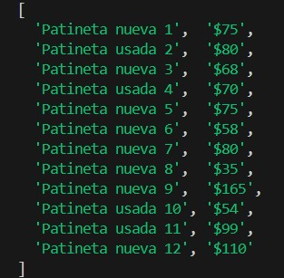

## ABOUT THIS DEMO 
Here is a web scraping demo using Playwright where data is extracted.
\
In this case, the extraction involves products along with their respective names and prices.

## RESULT OF SCRAPING A WEB PAGE



## NECESSARY KNOWLEDGE 

Init project
```bash
  npm init playwright@latest
```
\
or Create single test file
```bash
  npx playwright test name.ts
```
\
\
\
Code generate
```bash
  npx playwright codegen scrapepark.org/spanish/
```
\
\
\
Run scraping
```bash
  node index.js
```
\
Run test
```bash
  npx playwright test
```

## AUTHORS ✒️
*[@Cristina16z](https://github.com/cristina16z)*
